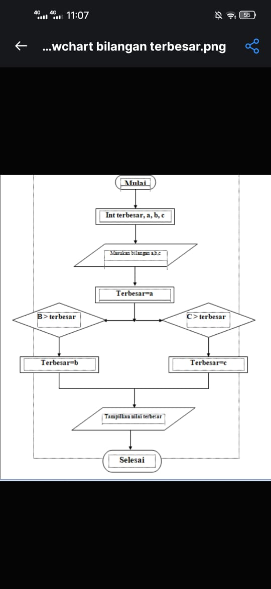
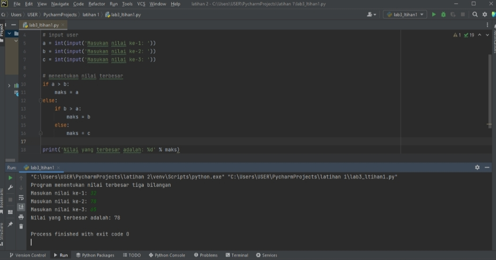

# labpy02
## penjelasan
1. Input bilangan sebanyak 3 input bilangan.
2. setelah bilangan di masukkan, maka program akan membandingkan ke 3 bilangan tersebut.
3. Perbandingan menggunakan statement if.
4. Ketika bilangan pertama (A), dibandingkan dengan bilangan ke dua (B), dan bilangan ke tiga (C). Apabila menghasilkan nilai bilangan ke dua, makan akan tercetak nilai yang di input oleh bilangan ke dua.
## Program dan Flowchart
### flowchart

### program dan hasil
